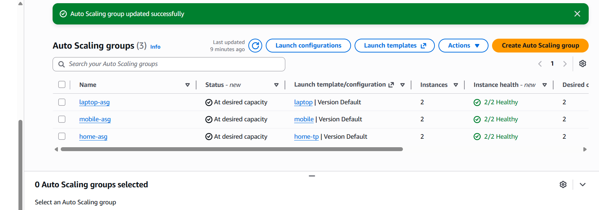
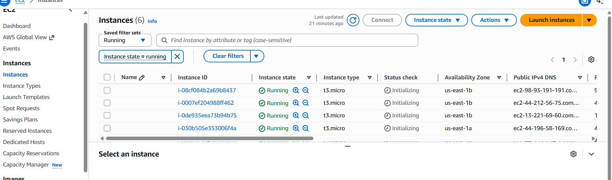
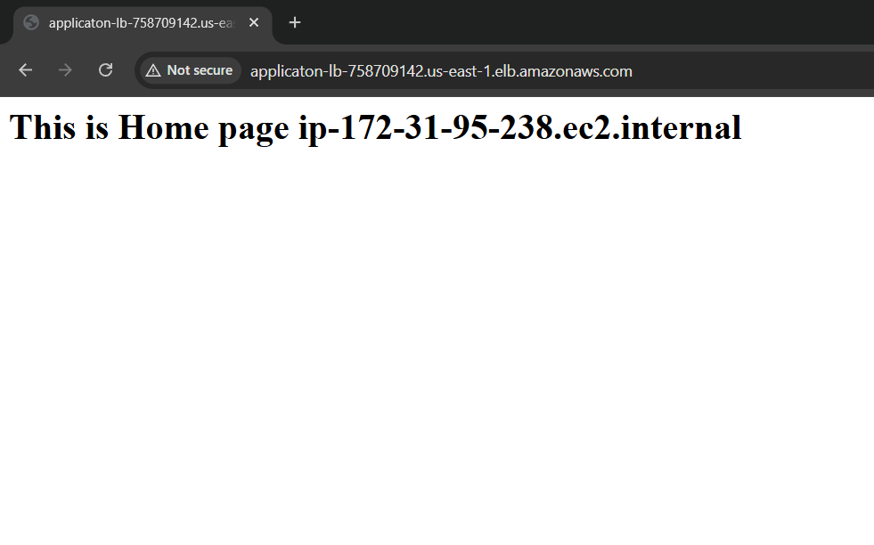
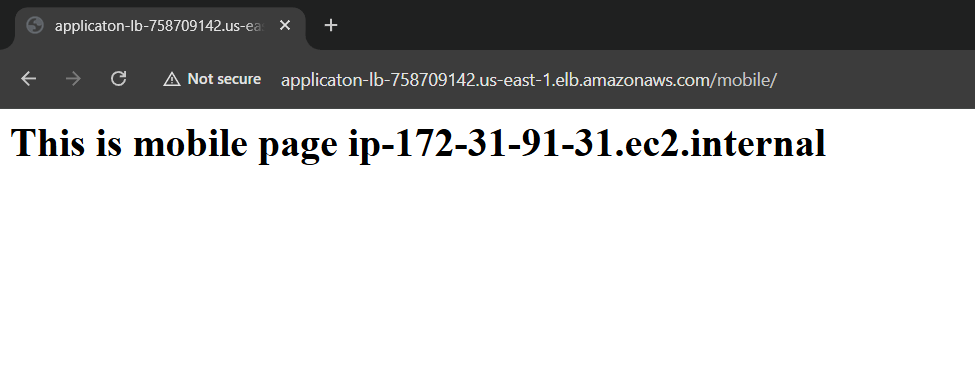
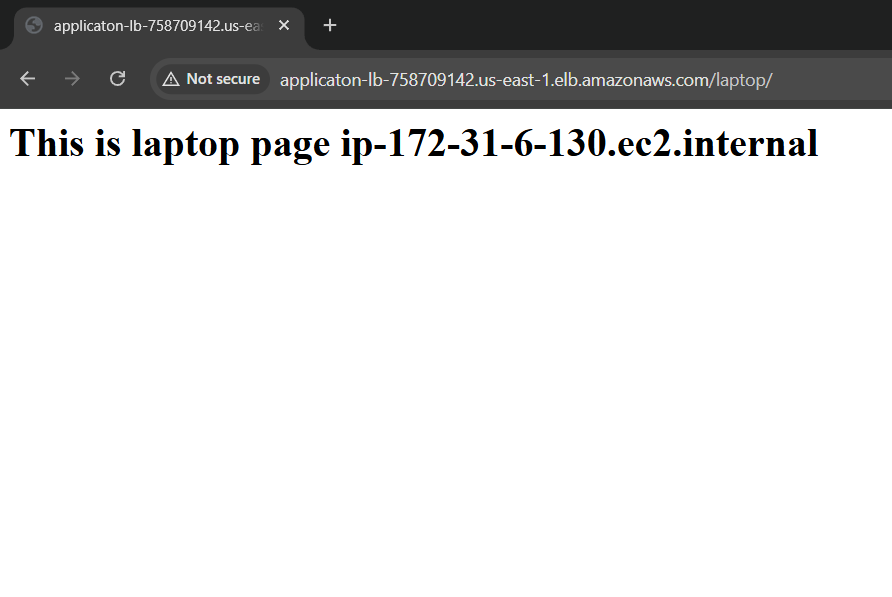
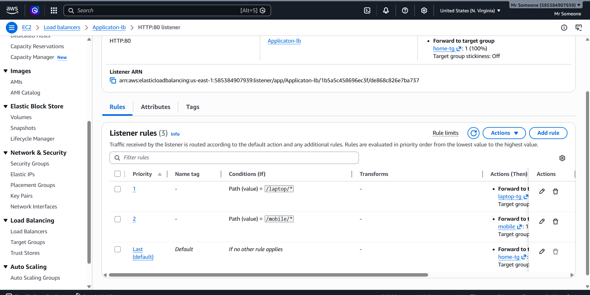
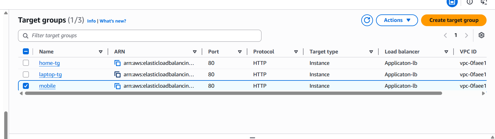

# AWS Auto Scaling Group with Application Loa
---
# Introduction

# Multi-Service Auto Scaling Configuration

In this project, different scaling methods are used for different services to demonstrate how AWS Auto Scaling works in real-world cloud environments.

Each service follows a separate scaling strategy based on application requirements and traffic patterns.

| Service | Scaling Type | Description |
|---|---|---|
| Home Service | Dynamic Scaling | Automatically adds or removes EC2 instances depending on traffic and CPU usage. |
| Mobile Service | Dynamic + Scheduled Scaling | Uses automatic scaling during high traffic and scheduled scaling for fixed peak hours. |
| Laptop Service | Static Scaling | Runs with a fixed number of EC2 instances without automatic scaling. |

---

# Scaling Techniques Used

## 1. Dynamic Scaling — Home Service

The Home Service uses Dynamic Scaling to automatically manage EC2 instances according to application load.

How it works:
- When traffic or CPU usage increases, AWS automatically launches new EC2 instances.
- When traffic becomes low, extra EC2 instances are automatically removed.

Advantages:
- Better performance during high traffic
- Efficient resource utilization
- Reduced infrastructure cost
- Automatic scaling without manual intervention

---

## 2. Dynamic + Scheduled Scaling — Mobile Service

The Mobile Service uses both Dynamic Scaling and Scheduled Scaling to handle variable and predictable traffic.

### Dynamic Scaling
AWS automatically increases or decreases EC2 instances based on CPU usage and incoming traffic.

### Scheduled Scaling
AWS launches or terminates instances at predefined times according to expected traffic patterns.

Example:
- During busy hours, more EC2 instances are launched automatically.
- During low traffic periods, unnecessary instances are removed.

Advantages:
- Handles expected and unexpected traffic efficiently
- Better application availability
- Improved performance during peak hours
- Optimized cloud resource usage

---

## 3. Static Scaling — Laptop Service

The Laptop Service uses Static Scaling with a fixed number of EC2 instances.

How it works:
- A predefined number of EC2 instances always remain running.
- No automatic scaling operations are performed.

Advantages:
- Stable and predictable infrastructure
- Simple configuration and management
- Suitable for applications with constant traffic


---

# Extended Architecture

```text
                           User Browser
                                  │
                                  ▼
                   Application Load Balancer
                                  │
        ┌─────────────────────────┼─────────────────────────┐
        │                         │                         │
        ▼                         ▼                         ▼

     Home TG                  Mobile TG                 Laptop TG
        │                         │                         │
   ┌────┴────┐               ┌────┴────┐              ┌────┴────┐
   ▼         ▼               ▼         ▼              ▼         ▼

 Home-ASG  Home-ASG      Mobile-ASG Mobile-ASG   Laptop-ASG Laptop-ASG
  EC2-1      EC2-2         EC2-1      EC2-2        EC2-1      EC2-2
```

---

# AWS Services Used

| Service | Purpose |
|---|---|
| EC2 | Hosting Applications |
| Auto Scaling Group | Automatic Scaling |
| Launch Template | EC2 Configuration |
| Application Load Balancer | Traffic Distribution |
| Target Groups | Route Requests |
| CloudWatch | Monitoring |
| Security Groups | Allow HTTP Traffic |

---

# Extended Project Structure

```text
AWS Cloud
│
├── Application Load Balancer
│
├── Listener Rules
│   ├── /mobile/*
│   ├── /laptop/*
│   └── default → home-tg
│
├── Target Groups
│   │
│   ├── home-tg
│   │     ├── home-asg
│   │     │      ├── home-ec2-1
│   │     │      └── home-ec2-2
│   │
│   ├── mobile-tg
│   │     ├── mobile-asg
│   │     │      ├── mobile-ec2-1
│   │     │      └── mobile-ec2-2
│   │
│   └── laptop-tg
│         ├── laptop-asg
│         │      ├── laptop-ec2-1
│         │      └── laptop-ec2-2
│
└── Launch Templates
      ├── home-template
      ├── mobile-template
      └── laptop-template
```

---

# Step 1 — Create Launch Templates

Create separate Launch Templates for:
- Home Service
- Mobile Service
- Laptop Service

Configuration:
- Amazon Linux 2023
- t3.micro
- Security Group
- Key Pair
- User Data Script

---

# Step 2 — Create Target Groups

Create three target groups:

| Target Group | Service |
|---|---|
| home-tg | Home Service |
| mobile-tg | Mobile Service |
| laptop-tg | Laptop Service |

Configuration:
- Protocol → HTTP
- Port → 80
- Target Type → Instance

---

# Step 3 — Create Application Load Balancer

Create an Application Load Balancer with:
- Internet Facing
- HTTP Listener on Port 80
- Attach all Target Groups

---

# Step 4 — Configure Listener Rules

Add path-based routing rules:

| Path | Target Group |
|---|---|
| /mobile/* | mobile-tg |
| /laptop/* | laptop-tg |
| Default | home-tg |

---

# Step 5 — Create Auto Scaling Groups

Create three Auto Scaling Groups:

| Auto Scaling Group | Desired Capacity |
|---|---|
| home-asg | 2 |
| mobile-asg | 2 |
| laptop-asg | 2 |

Attach corresponding:
- Launch Template
- Target Group
- Load Balancer

---

# Auto Scaling Working

The Auto Scaling Group continuously monitors EC2 instance health and automatically maintains the required number of instances.

If one instance fails:
- New EC2 instance is automatically launched.

If traffic increases:
- Additional EC2 instances can be created automatically.

Benefits:
- High Availability
- Fault Tolerance
- Better Performance
- Automatic Recovery
- Scalability

---

# Round Robin Technique

The Application Load Balancer uses the Round Robin algorithm to distribute incoming traffic equally between multiple EC2 instances.

Example:

- Request 1 → EC2-1
- Request 2 → EC2-2
- Request 3 → EC2-1
- Request 4 → EC2-2

This helps in:
- Balanced Traffic Distribution
- Reduced Server Load
- Improved Application Performance
- Better Resource Utilization

---

# Application URLs

## Home Page

```text
http://application-lb-dns-name/
```

---

## Mobile Page

```text
http://application-lb-dns-name/mobile/
```

---

## Laptop Page

```text
http://application-lb-dns-name/laptop/
```

---

# Screenshots

## Auto Scaling Groups

[](img/asg.png)

---

## EC2 Running Instances

[](img/ec2.png)

---

## Home Page Output

[](img/homer.png)

---

## Mobile Page Output

[](img/mobiler.png)

---

## Laptop Page Output

[](img/laptop.png)

---

## Load Balancer Listener Rules

[](img/lb-rules.png)

---

## Target Groups

[](img/tg.png)

---

# Security Group Configuration

| Type | Port |
|---|---|
| SSH | 22 |
| HTTP | 80 |

---

# Features

- Auto Scaling Groups
- Multiple EC2 Instances
- Dynamic Scaling
- Application Load Balancer
- Path-Based Routing
- Round Robin Load Distribution
- High Availability
- Fault Tolerance
- Automatic Recovery
- Scalable Cloud Architecture

---

# Future Improvements

- HTTPS SSL Configuration
- Route53 Domain Setup
- Jenkins CI/CD Integration
- Docker Deployment
- Kubernetes Integration
- Multi-AZ Deployment
- CloudWatch Dashboard

---

# Author

## Aryan Rajendra Dhawas

Fortune Cloude Technology  
AWS & DevOps Engineering

---

# Summary

This project successfully demonstrates implementation of AWS Auto Scaling Groups integrated with an Application Load Balancer using extended cloud architecture. Separate Auto Scaling Groups were created for Home, Mobile, and Laptop services, with multiple EC2 instances attached to each service for scalability and high availability. The Application Load Balancer distributed traffic using path-based routing and the Round Robin technique, while Auto Scaling Groups automatically maintained healthy EC2 instances and supported dynamic scaling based on infrastructure requirements.

---
